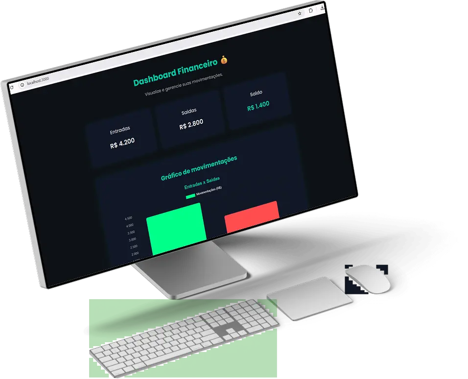

#  Dashboard Financeiro 💰

Oi! 👋  
Esse é um dos meus primeiros projetos feitos com React.  
Criei esse **painel financeiro** pra treinar e entender melhor como montar uma interface moderna, parecida com os apps de banco que a gente usa no dia a dia.

A ideia era simples: mostrar saldo, histórico de transações e um gráfico visual pra representar os gastos — tudo de um jeito limpo e fácil de entender.

---

## 🚀 O que eu quis treinar aqui

Esse projeto foi 100% voltado pra **prática**.  
Quis testar o que aprendi sobre:

- Estrutura de um projeto React  
- Componentes, props e estados  
- Organização do código e pastas  
- Estilização com CSS e responsividade  
- E também um pouquinho de **Node.js** (só pra rodar o ambiente e entender como o React funciona por trás)

---

## 🧠 Aprendizados

Durante o processo eu percebi o quanto **React facilita a vida** pra criar interfaces dinâmicas.  
Aprendi a pensar em blocos, dividir o código em partes menores e deixar tudo mais organizado.  
Também entendi melhor o poder do CSS pra deixar o visual bonito e funcional.

---

## 🖼️ Prévia do projeto

---

## 🛠️ Tecnologias usadas

- React.js  
- HTML5  
- CSS3  
- JavaScript  
- Node.js (básico)

---

## 🌐 Veja o site online

👉 [Acessar projeto no Netlify](https://dashboard-financeiro-raissaneri.netlify.app)

---
📧 **Email:** [issaneri190@gmail.com](mailto:issaneri190@gmail.com)  
💼 **LinkedIn:** [linkedin.com/in/raissaneri-dev](https://www.linkedin.com/in/raissaneri-dev)  
🌐 **Portfólio:** [meuportifolio-raissaneri.netlify.app](https://meuportifolio-raissaneri.netlify.app)

---

✨ *“Aprendendo um pouco mais a cada linha de código.”*
